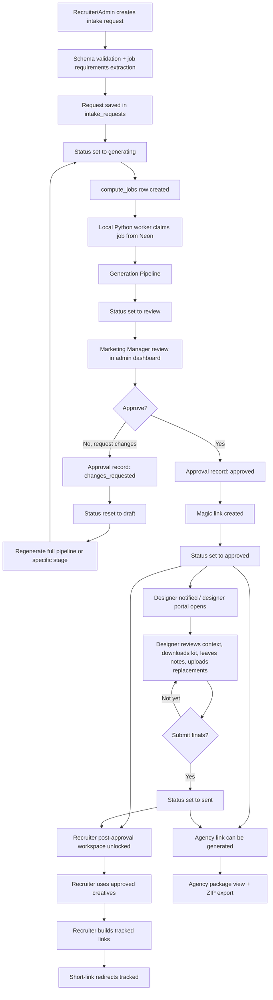
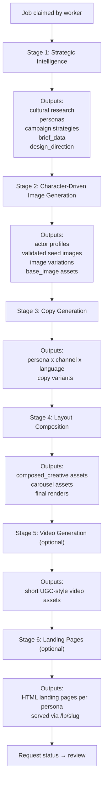
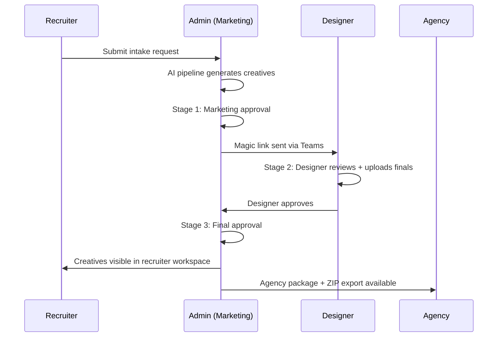

# Nova

AI-powered recruitment marketing platform. Intake form → AI generation pipeline → creative review → designer handoff → recruiter distribution → agency export.

**~80K LOC** | Next.js 16 + Python worker | Neon Postgres | Clerk Auth | Vercel

---

## Table of Contents / 目录

- [Overview / 概述](#overview--概述)
- [Architecture / 系统架构](#architecture--系统架构)
- [Tech Stack / 技术栈](#tech-stack--技术栈)
- [Getting Started / 快速开始](#getting-started--快速开始)
- [Project Structure / 项目结构](#project-structure--项目结构)
- [API Reference / API 参考](#api-reference--api-参考)
- [Database Schema / 数据库结构](#database-schema--数据库结构)
- [Pipeline Stages / 生成管线](#pipeline-stages--生成管线)
- [Roles & Permissions / 角色与权限](#roles--permissions--角色与权限)
- [Deployment / 部署指南](#deployment--部署指南)
- [Development Guide / 开发指南](#development-guide--开发指南)
- [CI Pipeline / 持续集成](#ci-pipeline--持续集成)
- [Docker / 容器化](#docker--容器化)
- [Troubleshooting / 故障排查](#troubleshooting--故障排查)

---

## Overview / 概述

Nova automates the creation of recruitment marketing campaigns. A recruiter submits a campaign request through a structured intake form. An AI pipeline generates cultural research, personas, actor images, ad copy, composed creatives, and optional video assets. A marketing manager reviews and approves the package, a designer refines finals, and the approved creatives are distributed to recruiters and ad agencies.

The system has two main subsystems:

1. **Web application** (Next.js) — Intake forms, review dashboards, designer portal, recruiter workspace, agency handoff, admin tools.
2. **Compute worker** (Python) — Polls a job queue, runs a multi-stage AI generation pipeline, uploads results to blob storage.

Both subsystems share the same Neon Postgres database. The database acts as both the data store and the message bus (via the `compute_jobs` table).

### End-to-End Workflow / 端到端流程



---

## Architecture / 系统架构

```
┌──────────────────────────────────────────────────────────────────────┐
│                         Vercel (Production)                          │
│                                                                      │
│  ┌─────────────────────┐    ┌──────────────────────────────────────┐ │
│  │   Next.js App        │    │          API Routes (30+)            │ │
│  │                      │    │                                      │ │
│  │  - Dashboard         │───▶│  /api/intake      (CRUD)            │ │
│  │  - Intake Form       │    │  /api/generate     (queue jobs)     │ │
│  │  - Marketing Review  │    │  /api/approve      (3-stage flow)   │ │
│  │  - Designer Portal   │    │  /api/designer     (magic link)     │ │
│  │  - Recruiter View    │    │  /api/export       (ZIP/Figma)      │ │
│  │  - Agency Handoff    │    │  /api/admin        (ops)            │ │
│  │  - Admin Panel       │    │  /api/extract      (RFP parsing)    │ │
│  └─────────────────────┘    └──────────┬───────────────────────────┘ │
│                                         │                            │
└─────────────────────────────────────────┼────────────────────────────┘
                                          │
                    ┌─────────────────────▼─────────────────────┐
                    │          Neon Postgres (Serverless)        │
                    │                                           │
                    │  intake_requests  │  compute_jobs (queue) │
                    │  creative_briefs  │  generated_assets     │
                    │  actor_profiles   │  tracked_links        │
                    │  + 12 more tables │  design_artifacts     │
                    └─────────────────────┬─────────────────────┘
                                          │
               ┌──────────────────────────▼──────────────────────────┐
               │              Python Worker (Local Machine)           │
               │                                                      │
               │  main.py  ← polls compute_jobs every 30s            │
               │                                                      │
               │  ┌────────┐  ┌────────┐  ┌────────┐  ┌────────┐   │
               │  │Stage 1 │→ │Stage 2 │→ │Stage 3 │→ │Stage 4 │   │
               │  │Intel   │  │Images  │  │Copy    │  │Compose │   │
               │  └────────┘  └────────┘  └────────┘  └────────┘   │
               │       ↓           ↓           ↓           ↓        │
               │  ┌────────┐  ┌────────┐                            │
               │  │Stage 5 │  │Stage 6 │   Results → Neon + Blob    │
               │  │Video   │  │Landing │                            │
               │  └────────┘  └────────┘                            │
               └────────────────────────────────────────────────────┘
                         │
          ┌──────────────┼──────────────────────────┐
          ▼              ▼                           ▼
   ┌────────────┐ ┌────────────┐           ┌──────────────┐
   │ OpenRouter  │ │ NVIDIA NIM │           │ Vercel Blob  │
   │ (LLM/Image)│ │ (Seedream) │           │ (Storage)    │
   └────────────┘ └────────────┘           └──────────────┘
```

**Data flow:**

1. User submits intake request → saved to `intake_requests`
2. Frontend creates a `compute_jobs` record with `status = 'pending'`
3. Worker polls for pending jobs, claims one, sets `status = 'processing'`
4. Worker runs pipeline stages sequentially, writing results to `creative_briefs`, `actor_profiles`, `generated_assets`
5. Generated images/HTML are uploaded to Vercel Blob, URLs stored in DB
6. Worker sets job `status = 'complete'`, frontend polls and renders results
7. Marketing manager reviews, approves → designer gets magic link notification via Teams
8. Designer uploads finals → recruiter sees approved creatives → agency gets export package

---

## Tech Stack / 技术栈

| Category | Technology | Purpose |
|----------|-----------|---------|
| **Framework** | Next.js 16 (App Router) | Server/client rendering, API routes |
| **Language** | TypeScript 5, React 19 | Frontend and API layer |
| **Styling** | Tailwind CSS 4 | Utility-first CSS, light theme |
| **Icons** | Lucide React | Consistent icon system |
| **Auth** | Clerk | SSO, role management, middleware protection |
| **Database** | Neon Postgres (serverless) | Primary data store + job queue |
| **Storage** | Vercel Blob | Image, HTML, and file storage |
| **Hosting** | Vercel | Production deployment |
| **Notifications** | Microsoft Teams webhooks | Adaptive card notifications |
| **Worker** | Python 3.11+ | AI pipeline orchestration |
| **LLM** | OpenRouter (Kimi K2.5, GLM-5) | Research, copy, composition |
| **Image Gen** | Seedream 4.5 (via NVIDIA NIM) | Actor and scene image generation |
| **Video** | Kling 3.0 API | Optional UGC-style video generation |
| **Local LLM** | MLX (Apple Silicon) | On-device inference fallback |
| **Rendering** | Playwright (headless Chromium) | HTML → PNG creative composition |
| **Rich Text** | TipTap | Inline content editing |
| **Figma** | figma-api | Push creatives to Figma |
| **Testing** | Vitest | Unit and integration tests |
| **Package** | pnpm | Node dependency management |

---

## Getting Started / 快速开始

### Prerequisites / 前置要求

- **Node.js** 20+ and **pnpm** 9+
- **Python** 3.11+ with `pip` or `uv`
- **Postgres** access (Neon account or local Postgres)
- **Clerk** account for authentication
- **Vercel** account for Blob storage tokens
- (Optional) **Apple Silicon Mac** for local MLX inference
- (Optional) **Playwright** browsers: `playwright install chromium`

### 1. Clone and install / 克隆与安装

```bash
git clone <repo-url>
cd centric-intake

# Install Node dependencies
pnpm install

# Install Python dependencies
cd worker
python -m venv .venv
source .venv/bin/activate
pip install -r requirements.txt
cd ..
```

### 2. Configure environment / 配置环境变量

```bash
# Web app
cp .env.example .env.local

# Worker
cp worker/.env.example worker/.env
```

Edit both files with your credentials. Both **must** share the same `DATABASE_URL` and `BLOB_READ_WRITE_TOKEN`.

**Required for web app:**

| Variable | Source | Description |
|----------|--------|-------------|
| `DATABASE_URL` | Neon dashboard | Postgres connection string |
| `CLERK_SECRET_KEY` | Clerk dashboard | Server-side auth key |
| `NEXT_PUBLIC_CLERK_PUBLISHABLE_KEY` | Clerk dashboard | Client-side auth key |
| `NEXT_PUBLIC_APP_URL` | Your URL | `http://localhost:3000` for dev |
| `BLOB_READ_WRITE_TOKEN` | Vercel dashboard | Blob storage access |
| `OPENROUTER_API_KEY` | OpenRouter | LLM access for extraction |
| `TEAMS_WEBHOOK_URL` | MS Teams | Notification delivery |

**Required for worker:**

| Variable | Source | Description |
|----------|--------|-------------|
| `DATABASE_URL` | Same as web app | Shared database |
| `BLOB_READ_WRITE_TOKEN` | Same as web app | Upload generated assets |
| `OPENROUTER_API_KEY` | OpenRouter | LLM for brief/copy/composition |
| `NVIDIA_NIM_API_KEY` | NVIDIA | Seedream image generation |
| `APP_URL` | Your URL | For notification links |
| `POLL_INTERVAL_SECONDS` | — | Job polling frequency (default: 30) |

### 3. Initialize database / 初始化数据库

```bash
# Ensure DATABASE_URL is set, then run:
node scripts/init-db.mjs
```

This creates all 18 tables and indexes. Safe to re-run (uses `IF NOT EXISTS`).

### 4. Run the application / 启动应用

**Terminal 1 — Web app:**

```bash
pnpm dev
# Runs at http://localhost:3000
```

**Terminal 2 — Worker:**

```bash
cd worker
source .venv/bin/activate
python main.py
# Polls compute_jobs every 30s
```

### 5. Create an admin user / 创建管理员

1. Open `http://localhost:3000/sign-up` and create an account via Clerk
2. In Neon SQL console or via `psql`, insert your role:

```sql
INSERT INTO user_roles (clerk_id, email, name, role)
VALUES ('user_xxxxx', 'you@example.com', 'Your Name', 'admin');
```

Replace `clerk_id` with the value from Clerk dashboard.

---

## Project Structure / 项目结构

```
centric-intake/
├── src/
│   ├── app/                          # Next.js App Router
│   │   ├── page.tsx                  # Dashboard (campaign list)
│   │   ├── api/                      # 30+ API routes
│   │   │   ├── intake/               #   Intake CRUD + progress polling
│   │   │   ├── generate/             #   Generation job management
│   │   │   ├── approve/              #   3-stage approval flow
│   │   │   ├── designer/             #   Magic link portal APIs
│   │   │   ├── assets/               #   Asset management + relayout
│   │   │   ├── export/               #   ZIP + Figma export
│   │   │   ├── extract/              #   RFP/paste text extraction
│   │   │   ├── admin/                #   User, job, stats management
│   │   │   ├── figma/                #   Figma connect/push/sync
│   │   │   ├── notify/               #   Teams/Slack/Outlook delivery
│   │   │   ├── tracked-links/        #   UTM short-link management
│   │   │   ├── schemas/              #   Dynamic form schema CRUD
│   │   │   ├── registries/           #   Option registry lookups
│   │   │   ├── compute/              #   Job status polling
│   │   │   ├── revise/               #   AI revision requests
│   │   │   └── auth/                 #   Auth context endpoint
│   │   ├── intake/                   # Intake form + detail pages
│   │   ├── admin/                    # Admin portal pages
│   │   ├── designer/                 # Designer portal pages
│   │   ├── agency/                   # Agency handoff pages
│   │   ├── lp/                       # Public landing page serving
│   │   ├── r/                        # Short-link redirect
│   │   └── sign-in/, sign-up/        # Clerk auth pages
│   │
│   ├── components/                   # ~57 React components
│   │   ├── CampaignWorkspace.tsx     #   Main marketing review workspace
│   │   ├── MediaStrategyEditor.tsx   #   Media strategy editor
│   │   ├── ActorCard.tsx             #   Persona actor display
│   │   ├── CreativeHtmlEditor.tsx    #   Live HTML creative editor
│   │   ├── EditableField.tsx         #   Inline editable fields
│   │   ├── RecruiterWorkspace.tsx    #   Recruiter creative library
│   │   ├── designer/                 #   Designer-specific components
│   │   │   ├── gallery/              #     Asset gallery + lightbox
│   │   │   ├── figma/                #     Figma integration UI
│   │   │   └── edit/                 #     Quick editor
│   │   ├── agency/                   #   Agency view components
│   │   ├── creative-gallery/         #   Channel-grouped creative view
│   │   └── ...                       #   Shared UI components
│   │
│   ├── lib/                          # Shared utilities
│   │   ├── db.ts                     #   Neon client initialization
│   │   ├── db/                       #   Data access layer
│   │   │   ├── intake.ts             #     intake_requests CRUD
│   │   │   ├── briefs.ts             #     creative_briefs CRUD
│   │   │   ├── actors.ts             #     actor_profiles CRUD
│   │   │   ├── assets.ts             #     generated_assets CRUD
│   │   │   ├── approvals.ts          #     approvals CRUD
│   │   │   ├── magic-links.ts        #     Magic link create/validate/consume
│   │   │   ├── compute-jobs.ts       #     Job queue management
│   │   │   ├── user-roles.ts         #     Role lookup + auto-provision
│   │   │   └── schemas.ts            #     Dynamic form schema CRUD
│   │   ├── auth.ts                   #   requireAuth(), requireRole()
│   │   ├── permissions.ts            #   Role-based access helpers
│   │   ├── sanitize.ts              #   DOMPurify HTML sanitization
│   │   ├── types.ts                  #   Shared TypeScript types (~430 lines)
│   │   ├── blob.ts                   #   Vercel Blob upload helper
│   │   ├── export.ts                 #   ZIP archive generation
│   │   ├── figma-client.ts           #   Figma API wrapper
│   │   ├── platforms.ts              #   Ad platform metadata
│   │   ├── notifications/            #   Teams, Slack, Outlook clients
│   │   └── tracked-links/            #   UTM tracking utilities
│   │
│   ├── hooks/                        # React hooks
│   │   ├── useAutosave.ts            #   Debounced autosave
│   │   └── useStrategyAutosave.ts    #   Strategy-specific autosave
│   │
│   └── middleware.ts                 # Clerk auth middleware
│
├── worker/                           # Python compute worker
│   ├── main.py                       # Entry point — polling loop
│   ├── neon_client.py                # Async Postgres client (asyncpg)
│   ├── config.py                     # Environment configuration
│   ├── pipeline/                     # Generation stages
│   │   ├── orchestrator.py           #   Stage sequencing + error handling
│   │   ├── stage1_intelligence.py    #   Cultural research + brief + strategy
│   │   ├── stage2_images.py          #   Actor generation + image creation
│   │   ├── stage3_copy.py            #   Ad copy generation per persona/channel
│   │   ├── stage4_compose_v3.py      #   HTML composition + Playwright render
│   │   ├── stage5_video.py           #   Video generation (Kling)
│   │   └── stage6_landing_pages.py   #   Landing page HTML generation
│   ├── ai/                           # Model clients
│   │   ├── seedream.py               #   Seedream image generation
│   │   ├── compositor.py             #   Playwright HTML→PNG rendering
│   │   ├── creative_vqa.py           #   Visual quality assurance scoring
│   │   ├── kling_client.py           #   Kling video API client
│   │   ├── local_llm.py              #   MLX local LLM inference
│   │   ├── local_vlm.py              #   MLX local vision model
│   │   ├── tts_engine.py             #   Text-to-speech (Coqui TTS)
│   │   └── wav2lip.py                #   Lip-sync for video
│   ├── prompts/                      # Prompt templates (~29 files)
│   │   ├── intelligence_prompt.py    #   Stage 1: research + brief
│   │   ├── copy_prompt.py            #   Stage 3: ad copy
│   │   ├── compositor_prompt.py      #   Stage 4: HTML composition
│   │   ├── evaluator_*.py            #   Quality evaluation prompts
│   │   └── ...                       #   Channel rules, brand prompts
│   ├── brand/                        # Brand configuration
│   │   └── oneforma.py               #   Brand rules, copy constraints
│   ├── blob_uploader.py              # Vercel Blob upload utility
│   ├── cache_manager.py              # Research cache (disk-based)
│   ├── mlx_server_manager.py         # Local MLX server lifecycle
│   └── requirements.txt              # Python dependencies
│
├── scripts/                          # Utility scripts
│   ├── init-db.mjs                   # Database schema initialization
│   ├── add-magic-link-used-at.mjs    # Migration: magic link tracking
│   ├── seed-design-artifacts.mjs     # Seed design artifact catalog
│   └── verify-composition-engine.mjs # End-to-end pipeline verification
│
├── docs/                             # Documentation
│   ├── technical-breakdown.md        # Architecture deep-dive
│   ├── workflow/                     # Mermaid diagrams + HTML slides
│   └── superpowers/                  # Design specs + implementation plans
│
├── .env.example                      # Web app env template
├── CLAUDE.md                         # AI assistant instructions
├── package.json                      # Node dependencies + scripts
├── tsconfig.json                     # TypeScript configuration
├── next.config.ts                    # Next.js configuration
└── tailwind.config.ts                # Tailwind CSS configuration
```

---

## API Reference / API 参考

All API routes are in `src/app/api/`. Authentication is via Clerk middleware unless noted otherwise.

### Intake / 需求管理

| Method | Path | Auth | Description |
|--------|------|------|-------------|
| `POST` | `/api/intake` | Clerk | Create new intake request |
| `GET` | `/api/intake/[id]` | Clerk + ownership | Get request details |
| `PATCH` | `/api/intake/[id]` | Clerk + canEdit | Update request fields |
| `DELETE` | `/api/intake/[id]` | Clerk + canEdit | Delete request |
| `GET` | `/api/intake/[id]/progress` | Clerk | Poll generation progress (brief, actors, assets, job status) |
| `GET` | `/api/intake/[id]/assets` | Clerk + ownership | List assets for request |
| `GET` | `/api/intake/[id]/landing-pages` | Clerk + ownership | Get landing page URLs |

### Generation / 生成管理

| Method | Path | Auth | Description |
|--------|------|------|-------------|
| `POST` | `/api/generate/[id]` | Clerk | Queue full pipeline generation |
| `GET` | `/api/generate/[id]/brief` | Clerk | Get creative brief |
| `POST` | `/api/generate/[id]/brief` | Clerk | Regenerate Stage 1 |
| `GET` | `/api/generate/[id]/actors` | Clerk | Get actor profiles |
| `POST` | `/api/generate/[id]/actors` | Clerk | Regenerate Stage 2 |
| `GET` | `/api/generate/[id]/images` | Clerk | Get generated assets |
| `GET` | `/api/generate/[id]/strategy` | Clerk | Get campaign strategies |
| `PATCH` | `/api/generate/[id]/strategy` | Clerk | Update strategy data (autosave) |
| `POST` | `/api/generate/[id]/research` | Clerk | Regenerate cultural research |
| `POST` | `/api/generate/[id]/copy` | Clerk | Regenerate Stage 3 copy |
| `POST` | `/api/generate/[id]/compose` | Clerk | Regenerate Stage 4 composition |

### Approval / 审批流程

| Method | Path | Auth | Description |
|--------|------|------|-------------|
| `POST` | `/api/approve/[id]` | Clerk + role | 3-stage approval (marketing→designer→final) |

Approval types: `marketing` (admin only), `designer` (admin/designer), `final` (admin only).

### Designer Portal / 设计师门户

| Method | Path | Auth | Description |
|--------|------|------|-------------|
| `GET` | `/api/designer/[id]` | Magic link | Full campaign context for designer |
| `POST` | `/api/designer/[id]/upload` | Magic link or Clerk | Upload final deliverables |
| `GET/POST` | `/api/designer/[id]/notes` | Magic link or Clerk | Read/write asset notes |
| `POST` | `/api/designer/[id]/submit-finals` | Magic link | Submit finals (consumes token) |

### Extraction / 文档提取

| Method | Path | Auth | Description |
|--------|------|------|-------------|
| `POST` | `/api/extract/paste` | Clerk | Extract fields from pasted text |
| `POST` | `/api/extract/rfp` | Clerk | Extract fields from uploaded RFP |

### Assets / 素材管理

| Method | Path | Auth | Description |
|--------|------|------|-------------|
| `GET` | `/api/assets/[id]` | Clerk | Get single asset details |
| `PATCH` | `/api/assets/[id]` | Clerk | Update asset metadata |
| `POST` | `/api/assets/[id]/relayout` | Clerk | Request composition relayout |

### Export / 导出

| Method | Path | Auth | Description |
|--------|------|------|-------------|
| `POST` | `/api/export/[id]` | Clerk | Generate ZIP archive |
| `POST` | `/api/export/figma-package/[id]` | Clerk | Generate Figma-ready package |

### Admin / 管理后台

| Method | Path | Auth | Description |
|--------|------|------|-------------|
| `GET` | `/api/admin/jobs` | Admin | List compute jobs |
| `GET` | `/api/admin/stats` | Admin | Pipeline statistics |
| `GET/POST` | `/api/admin/users` | Admin | User role management |
| `GET/POST/DELETE` | `/api/admin/artifacts` | Admin | Design artifact catalog |

### Notifications / 通知

| Method | Path | Auth | Description |
|--------|------|------|-------------|
| `POST` | `/api/notify/[id]/teams` | Clerk | Send Teams notification |
| `POST` | `/api/notify/[id]/slack` | Clerk | Send Slack notification |
| `POST` | `/api/notify/[id]/outlook` | Clerk | Send Outlook notification |

### Figma / Figma 集成

| Method | Path | Auth | Description |
|--------|------|------|-------------|
| `POST` | `/api/figma/connect` | Clerk + canEdit | Link Figma file to request |
| `POST` | `/api/figma/push` | Clerk | Push assets to Figma |
| `GET` | `/api/figma/sync/[id]` | Clerk | Get sync status |

### Public Routes / 公开路由

| Method | Path | Auth | Description |
|--------|------|------|-------------|
| `GET` | `/r/[slug]` | None | Short-link redirect (6-char alphanumeric) |
| `GET` | `/lp/[slug]` | None | Public landing page (campaign--persona format) |
| `GET` | `/api/schemas` | None | List active intake form schemas |
| `GET` | `/api/schemas/[taskType]` | None | Get specific schema |
| `GET` | `/api/registries/[name]` | None | Get option registry values |

### Other / 其他

| Method | Path | Auth | Description |
|--------|------|------|-------------|
| `GET` | `/api/compute/status/[id]` | Clerk | Poll compute job status |
| `POST` | `/api/revise` | Clerk | Request AI revision of asset |
| `GET/POST` | `/api/tracked-links` | Clerk | Manage UTM tracked links |
| `GET` | `/api/auth/me` | Clerk | Current user context + role |

---

## Database Schema / 数据库结构

18 tables. All use UUID primary keys with `gen_random_uuid()`. Foreign keys cascade on delete. Schema initialized via `scripts/init-db.mjs`.

### Core Tables / 核心表

| Table | Purpose | Key Columns |
|-------|---------|-------------|
| `intake_requests` | Campaign requests | `title`, `task_type`, `urgency`, `status` (draft→generating→review→approved→sent), `form_data` (JSONB), `created_by`, `campaign_slug` |
| `creative_briefs` | Stage 1 output | `brief_data` (JSONB — personas, strategy, research), `channel_research` (JSONB), `design_direction` (JSONB), `evaluation_score`, `pillar_primary` |
| `actor_profiles` | Stage 2 personas | `name`, `face_lock` (JSONB — facial parameters), `prompt_seed`, `outfit_variations` (JSONB), `backdrops[]` |
| `generated_assets` | All creatives | `asset_type` (base_image/composed_creative/carousel_panel), `platform`, `format`, `blob_url`, `evaluation_score`, `evaluation_passed`, `stage`, `content` (JSONB), `copy_data` (JSONB) |
| `campaign_strategies` | Media strategies | `country`, `tier`, `monthly_budget`, `strategy_data` (JSONB — campaigns, ad_sets, channel_allocation) |

### Workflow Tables / 流程表

| Table | Purpose | Key Columns |
|-------|---------|-------------|
| `compute_jobs` | Job queue (worker polls this) | `job_type` (generate/regenerate/regenerate_stage/regenerate_asset), `status` (pending→processing→complete/failed), `stage_target`, `feedback` |
| `pipeline_runs` | Stage execution log | `stage`, `stage_name`, `status` (running/passed/failed), `duration_ms`, `error_message` |
| `approvals` | Approval records | `approved_by`, `status` (approved/changes_requested/rejected), `notes` |
| `magic_links` | Time-limited designer access | `token` (UUID), `expires_at`, `used_at` (single-use tracking) |
| `notifications` | Delivery tracking | `channel` (teams/slack/outlook), `recipient`, `status`, `payload` (JSONB) |

### Supporting Tables / 辅助表

| Table | Purpose | Key Columns |
|-------|---------|-------------|
| `task_type_schemas` | Dynamic form definitions | `task_type`, `schema` (JSONB — field definitions), `version`, `is_active` |
| `schema_versions` | Schema version history | `schema_id` (FK), `version`, `schema` (JSONB), `change_summary` |
| `option_registries` | Dropdown/select options | `registry_name`, `option_value`, `option_label`, `metadata` (JSONB) |
| `user_roles` | RBAC | `clerk_id`, `email`, `role` (admin/recruiter/designer/viewer), `is_active` |
| `attachments` | Uploaded files | `request_id` (FK), `blob_url`, `extracted_text`, `is_rfp` |
| `designer_uploads` | Designer final files | `request_id` (FK), `original_asset_id`, `blob_url` |
| `tracked_links` | UTM short links | `slug` (6-char), `destination_url`, `utm_*` fields, `click_count` |
| `design_artifacts` | Reusable design elements | `artifact_id`, `category`, `blob_url`, `usage_snippet`, `pillar_affinity[]` |
| `campaign_landing_pages` | Landing page URLs | `request_id` (unique), `job_posting_url`, `landing_page_url`, `ada_form_url` |

### Key Indexes / 关键索引

- `idx_intake_status` — Fast status filtering on dashboard
- `idx_compute_jobs_pending` — Partial index: `WHERE status = 'pending'` for worker polling
- `idx_tracked_links_slug` — Short link lookups
- `idx_design_artifacts_active` — Partial index: active artifacts only
- `idx_intake_campaign_slug` — Landing page slug resolution

---

## Pipeline Stages / 生成管线

The worker runs stages sequentially. Each stage writes results to the database and uploads files to Vercel Blob. The frontend polls `/api/intake/[id]/progress` to render results as they arrive.



### Stage 1: Strategic Intelligence / 战略情报

**File:** `worker/pipeline/stage1_intelligence.py`

| Input | Output |
|-------|--------|
| Intake request `form_data` | `creative_briefs` record |
| Target regions, languages | Cultural research (JSONB) |
| | Personas with targeting profiles |
| | Campaign strategy + messaging pillars |
| | Design direction |
| | Channel allocation recommendations |

**Models:** OpenRouter (Kimi K2.5) for research and brief generation.

### Stage 2: Character-Driven Image Generation / 角色驱动图像生成

**File:** `worker/pipeline/stage2_images.py`

| Input | Output |
|-------|--------|
| Personas from Stage 1 | `actor_profiles` records |
| Design direction | `generated_assets` (type: base_image) |
| Brand constraints | Evaluation scores per image |

**Models:** Seedream 4.5 (via NVIDIA NIM or OpenRouter) for image generation. Creative VQA for quality scoring (pass threshold: 0.85).

### Stage 3: Copy Generation / 文案生成

**File:** `worker/pipeline/stage3_copy.py`

| Input | Output |
|-------|--------|
| Brief + personas from Stage 1 | `generated_assets` (type: copy) |
| Cultural research | Per-persona, per-channel copy variants |
| Target languages | Pillar-weighted messaging (primary + secondary) |

**Models:** OpenRouter (Kimi K2.5 or GLM-5) for copy generation. Copy evaluated against brand voice rules.

### Stage 4: Layout Composition / 版面合成

**File:** `worker/pipeline/stage4_compose_v3.py`

| Input | Output |
|-------|--------|
| Actor images from Stage 2 | `generated_assets` (type: composed_creative, carousel_panel) |
| Copy from Stage 3 | Platform-sized HTML creatives |
| Design artifacts catalog | Rendered PNG via Playwright |
| Brand constraints | Evaluation scores + quality grading |

**Models:** GLM-5 (via OpenRouter) generates HTML creatives using design artifacts. Playwright renders HTML to PNG. 8-category grading matrix scores output quality.

### Stage 5: Video Generation (Optional) / 视频生成（可选）

**File:** `worker/pipeline/stage5_video.py`

| Input | Output |
|-------|--------|
| Actor images | Short-form UGC-style videos |
| Copy scripts | Lip-synced talking-head content |

**Models:** Kling 3.0 for video generation. Coqui TTS for voice. Wav2Lip for lip-sync.

### Stage 6: Landing Pages (Optional) / 着陆页（可选）

**File:** `worker/pipeline/stage6_landing_pages.py`

| Input | Output |
|-------|--------|
| Brief + personas | HTML landing pages per persona |
| Copy + images | Uploaded to Blob, served via `/lp/[slug]` |

---

## Roles & Permissions / 角色与权限

Roles are stored in `user_roles` table and resolved via `src/lib/permissions.ts`.

### 3-Stage Approval Flow / 三阶段审批流程



| Capability | Admin | Recruiter | Designer | Viewer |
|-----------|:-----:|:---------:|:--------:|:------:|
| View all requests | Yes | Own only | Via magic link | Yes |
| Create intake request | Yes | Yes | No | No |
| Edit draft requests | Yes | Own only | No | No |
| Delete draft requests | Yes | Own only | No | No |
| Approve (marketing stage) | Yes | No | No | No |
| Approve (designer stage) | Yes | No | Yes | No |
| Approve (final stage) | Yes | No | No | No |
| Upload designer finals | Yes | No | Yes (magic link) | No |
| View admin panel | Yes | No | No | No |
| Manage users/roles | Yes | No | No | No |
| View recruiter workspace | Yes | Yes | No | No |
| Create tracked links | Yes | Yes | No | No |
| Connect Figma | Yes | Own drafts | No | No |

**Magic links:** Designers access campaigns via time-limited tokens (7-day expiry, single-use on submit). No Clerk account required.

**Auto-provisioning:** New Clerk users are assigned `recruiter` role by default via `src/lib/db/user-roles.ts`.

---

## Deployment / 部署指南

### Vercel Deployment / Vercel 部署

```bash
# Install Vercel CLI
npm i -g vercel

# Link project
vercel link

# Deploy preview
vercel

# Deploy production
vercel --prod
```

### Environment Variables Checklist / 环境变量清单

Set these in Vercel dashboard → Settings → Environment Variables:

| Variable | Required | Notes |
|----------|:--------:|-------|
| `DATABASE_URL` | Yes | Neon connection string (pooled) |
| `CLERK_SECRET_KEY` | Yes | From Clerk dashboard |
| `NEXT_PUBLIC_CLERK_PUBLISHABLE_KEY` | Yes | From Clerk dashboard |
| `NEXT_PUBLIC_CLERK_SIGN_IN_URL` | Yes | `/sign-in` |
| `NEXT_PUBLIC_CLERK_SIGN_UP_URL` | Yes | `/sign-up` |
| `NEXT_PUBLIC_APP_URL` | Yes | Production URL (e.g., `https://nova-intake.vercel.app`) |
| `BLOB_READ_WRITE_TOKEN` | Yes | Vercel Blob token |
| `OPENROUTER_API_KEY` | Yes | For RFP extraction |
| `TEAMS_WEBHOOK_URL` | Optional | Microsoft Teams notifications |
| `SLACK_WEBHOOK_URL` | Optional | Slack notifications |
| `NVIDIA_NIM_API_KEY` | Worker only | Not needed in Vercel |

### Post-Deploy Steps / 部署后步骤

1. Run database initialization: `DATABASE_URL="..." node scripts/init-db.mjs`
2. Run magic link migration: `DATABASE_URL="..." node scripts/add-magic-link-used-at.mjs`
3. Seed design artifacts: `DATABASE_URL="..." BLOB_READ_WRITE_TOKEN="..." node scripts/seed-design-artifacts.mjs`
4. Create admin user in `user_roles` table
5. Verify Teams webhook delivers notifications

### Worker Deployment / Worker 部署

The Python worker runs on a local machine (not Vercel). It needs:

- Network access to Neon Postgres (same `DATABASE_URL`)
- Network access to Vercel Blob (same `BLOB_READ_WRITE_TOKEN`)
- Network access to AI providers (OpenRouter, NVIDIA NIM)
- (Optional) Apple Silicon GPU for local MLX inference
- (Optional) Playwright + Chromium for Stage 4 rendering

```bash
cd worker
source .venv/bin/activate
python main.py
```

The worker auto-reconnects on database errors and logs all activity to stdout.

---

## Development Guide / 开发指南

### Code Conventions / 代码规范

- **Server Components by default.** Only add `'use client'` when the component needs interactivity.
- **Light theme only.** White backgrounds, dark text. No dark mode.
- **System fonts.** `-apple-system, system-ui, "Segoe UI", Roboto, sans-serif`. No Google Fonts.
- **Lucide icons only.** No emoji in UI.
- **CSS classes from `globals.css`:** `.btn-primary`, `.btn-secondary`, `.badge`, `.badge-*`, `.card`, `.gradient-accent`.
- **Generous whitespace:** `gap-6`, `p-6`, `space-y-4`.
- **All interactive elements** need `cursor-pointer`.

### Adding a New API Route / 添加新 API 路由

1. Create `src/app/api/your-route/route.ts`
2. Use `getAuthContext()` from `@/lib/permissions` for auth + role resolution
3. Use `canAccessRequest()` or `canEditRequest()` for ownership checks
4. Use tagged template SQL via `getDb()` from `@/lib/db` — never string concatenation
5. Return `Response.json(...)` with appropriate status codes

```typescript
import { getAuthContext } from '@/lib/permissions';
import { getDb } from '@/lib/db';

export async function GET(request: Request) {
  const ctx = await getAuthContext();
  if (!ctx) {
    return Response.json({ error: 'Unauthorized' }, { status: 401 });
  }

  const sql = getDb();
  const rows = await sql`SELECT * FROM your_table WHERE created_by = ${ctx.userId}`;
  return Response.json({ data: rows });
}
```

### Adding a New Pipeline Stage / 添加新管线阶段

1. Create `worker/pipeline/stage_N_name.py`
2. Implement an async function: `async def run(request_id: str, job: dict, conn) -> None`
3. Read inputs from previous stage output in the database
4. Call AI models via clients in `worker/ai/`
5. Write results to the appropriate table
6. Upload files via `worker/blob_uploader.py`
7. Register the stage in `worker/pipeline/orchestrator.py`

### Commit Style / 提交规范

```
feat: add new feature
fix: fix a bug
fix(security): security-related fix
refactor: code restructuring
docs: documentation only
test: test additions
```

### Testing / 测试

```bash
# Run all tests
pnpm test

# Watch mode
pnpm test:watch

# Run specific test file
npx vitest run src/lib/__tests__/your-test.ts
```

### Build Verification / 构建验证

```bash
# TypeScript compilation + Next.js build
pnpm build

# Lint
pnpm lint
```

---

## CI Pipeline / 持续集成

Every push to `main` and every pull request runs 5 parallel checks via GitHub Actions:

| Check | Command | What it catches |
|-------|---------|----------------|
| **Build** | `pnpm build` | TypeScript errors, Next.js compilation |
| **Lint** | `pnpm lint` | ESLint code style violations |
| **Test** | `pnpm test` | Unit test failures (Vitest) |
| **Python Lint** | `ruff check worker/` | Python code quality issues |
| **Docker Build** | `docker build ./worker` | Dockerfile or dependency errors |

All 5 must pass before merging. The workflow file is at `.github/workflows/ci.yml`.

**Concurrency:** Pushes to the same branch cancel in-progress runs to save CI minutes.

---

## Docker / 容器化

The Python worker can be containerized for Azure VM or any Linux deployment.

### Quick Start / 快速启动

```bash
# Build the worker image
docker build -t nova-worker ./worker

# Run with env file
docker run --env-file worker/.env nova-worker
```

### Using docker-compose / 使用 docker-compose

```bash
# Production-like (built image)
docker compose up worker

# Development (live code mount)
docker compose up worker-dev

# Rebuild after dependency changes
docker compose build
```

### Multi-arch Build / 多架构构建

```bash
# Build for both Azure VM (amd64) and Apple Silicon (arm64)
docker buildx build --platform linux/amd64,linux/arm64 -t nova-worker ./worker
```

### MLX Note / MLX 说明

The Docker image does **not** include MLX, TTS, torch, or other Apple Silicon dependencies. When running in Docker, the worker uses cloud AI providers (OpenRouter, NVIDIA NIM) for all inference. For local MLX inference on Apple Silicon, run the worker directly:

```bash
cd worker && source .venv/bin/activate && python main.py
```

### Requirements Files / 依赖文件

| File | Purpose |
|------|---------|
| `worker/requirements.txt` | Full dependencies (local Mac development with MLX) |
| `worker/requirements-docker.txt` | Cloud-only dependencies (Docker builds — no MLX/TTS/torch) |

---

## Troubleshooting / 故障排查

### Worker not picking up jobs / Worker 不处理任务

1. Check `compute_jobs` table for `status = 'pending'` rows
2. Verify `DATABASE_URL` matches between web app and worker
3. Check worker stdout for connection errors
4. Verify `POLL_INTERVAL_SECONDS` (default: 30)

```sql
SELECT id, job_type, status, created_at FROM compute_jobs ORDER BY created_at DESC LIMIT 10;
```

### Build fails with TypeScript errors / TypeScript 构建错误

```bash
# Check for errors
pnpm build 2>&1 | grep "error"

# Pre-existing test mock issues in src/app/api/figma/__tests__/ can be ignored
```

### Auth errors (401/403) / 认证错误

- **401 Unauthorized:** User not signed in, or Clerk middleware not matching the route
- **403 Forbidden:** User signed in but lacks the required role. Check `user_roles` table:

```sql
SELECT * FROM user_roles WHERE clerk_id = 'user_xxxxx';
```

### Pipeline stuck in "generating" / 管线卡在 "generating" 状态

1. Check job status: `SELECT * FROM compute_jobs WHERE request_id = '...' ORDER BY created_at DESC`
2. If `status = 'failed'`, check `error_message` column
3. If `status = 'processing'` for >10 minutes, the worker may have crashed. Reset:

```sql
UPDATE compute_jobs SET status = 'pending', started_at = NULL WHERE id = '...' AND status = 'processing';
```

### Images not generating / 图片未生成

- Verify `NVIDIA_NIM_API_KEY` is valid and has credits
- Check worker logs for Seedream API errors
- Verify `BLOB_READ_WRITE_TOKEN` is valid (images upload to Vercel Blob)

### Teams notifications not sending / Teams 通知未发送

- Verify `TEAMS_WEBHOOK_URL` is set and the webhook is active
- Test manually: `curl -X POST -H "Content-Type: application/json" -d '{"text":"test"}' "$TEAMS_WEBHOOK_URL"`

### Magic link not working / 魔法链接无效

- Links expire after 7 days
- Links are single-use (consumed on submit-finals)
- Check: `SELECT token, expires_at, used_at FROM magic_links WHERE request_id = '...'`

---

## Additional Documentation / 补充文档

| Document | Path | Description |
|----------|------|-------------|
| Technical breakdown | `docs/technical-breakdown.md` | Architecture deep-dive |
| Workflow diagrams | `docs/workflow/` | Mermaid + HTML visual workflows |
| Worker README | `worker/README.md` | Worker-specific setup |
| Brand configuration | `worker/brand/` | OneForma brand rules |
| Design specs | `docs/superpowers/specs/` | Feature design documents |
| Implementation plans | `docs/superpowers/plans/` | Step-by-step build plans |
