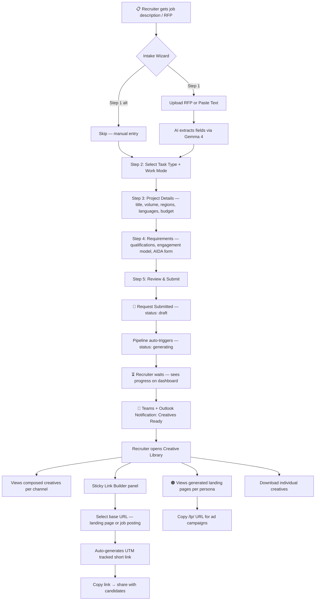
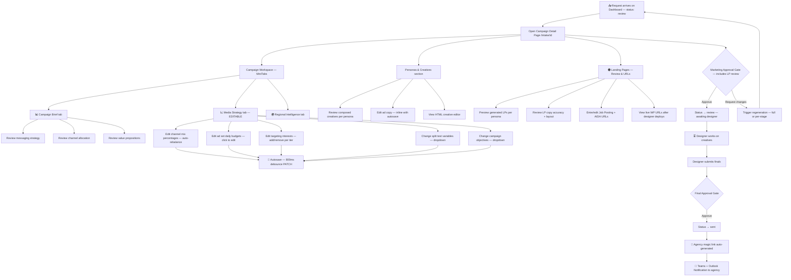
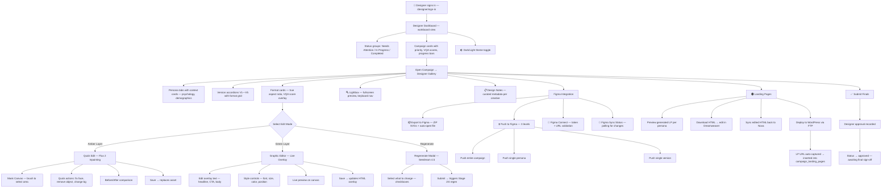
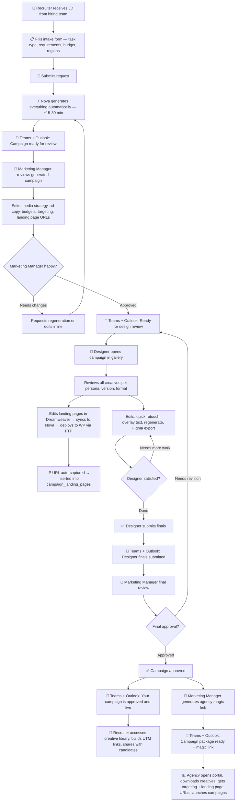

# Nova — Complete Workflow Maps

**Date:** 2026-04-13
**Author:** Steven Junop + Claude

Six perspectives on the same system: Recruiter, Marketing Manager, Designer, Agency, and Full System Pipeline. All workflows include the Stage 6 Landing Page Engine.

---

## 1. Recruiter Workflow

What the recruiter sees and does — from intake submission to candidate link sharing.



**Access:** `/intake/[id]` (authenticated), `/r/[slug]` (redirect)
**Cannot see:** Strategy details, raw assets, pipeline stages, designer tools

---

## 2. Marketing Manager Workflow

Command center — review, edit strategy, approve, and hand off to agency.



**Access:** `/intake/[id]` (admin role)
**Editable:** Media strategy (budgets, interests, split tests, objectives), ad copy, landing page URLs

---

## 3. Designer Workflow

Miguel's full toolkit — gallery review, editing, Figma integration, and handoff.



**Access:** `/designer` portal (designer role), `/designer/[id]` per campaign
**Tools:** Quick Edit (Flux 2), Graphic Editor (overlay), Regenerate (Seedream), Figma (export/push/sync), LP Deploy (Dreamweaver → FTP → WP)

---

## 4. Paid Media Agency Workflow

What the agency receives via magic link — strategy, creatives, targeting, and downloads.

```mermaid
flowchart TD
    A[📧 Agency receives magic link via Teams + Outlook email]
    A --> B[Opens /agency/id?token=... — no login required]

    B --> C[Agency Portal — 2 tabs]

    C --> D[Tab 1: Overview & Strategy]
    D --> D1[Campaign title, slug, status badge]
    D --> D2[Persona cards — demographics, targeting, psychology]
    D --> D3[Channel mix visualization — stacked bars]
    D --> D4[Budget allocation per channel]

    C --> E[Tab 2: Channels & Ad Sets]
    E --> E1[Per-channel accordion sections]
    E1 --> E2[Ad set cards with full targeting]
    E2 --> E2a[Interests — hyper/hot/broad tiers]
    E2 --> E2b[Demographics — age range, gender, location]
    E2 --> E2c[Placements — feed, story, reels]
    E2 --> E2d[Kill rules + scale rules]
    E1 --> E3[Creative thumbnails per ad set]
    E1 --> E4[Ad copy per creative — headline, body, CTA]
    E1 --> E5[UTM tracked links per creative]

    E1 --> LP[🟠 Landing page URLs per persona]
    LP --> LP1[/lp/campaign--persona links for ad destinations]

    C --> F[📥 Download All — ZIP of all creatives]
    C --> G[📥 Download individual creative]

    B --> H[⏰ Package expires in 7 days]
```

**Access:** `/agency/[id]?token=...` (magic link, no auth)
**Cannot:** Edit anything. Read-only view + downloads.

---

## 5. Full System Pipeline

Technical flow — all 6 stages, gates, notifications, and data stores.

```mermaid
flowchart TD
    START[👤 Recruiter submits intake form]
    START --> DB1[(intake_requests — status: draft)]
    DB1 --> JOB[compute_job created — type: generate]
    JOB --> WORKER[🔧 Python Worker claims job]

    WORKER --> S1[Stage 1: Strategic Intelligence]
    S1 --> S1a[Kimi K2.5 — RFP analysis]
    S1a --> S1b[Generate: brief, personas, cultural research, design direction]
    S1b --> S1c[Derive requirements from job description]
    S1c --> DB2[(creative_briefs + campaign_strategies)]

    DB2 --> S2[Stage 2: Character-Driven Images]
    S2 --> S2a[Create actor profiles per persona]
    S2a --> S2b[Seedream 4.5 — generate seed images]
    S2b --> S2c{VQA Gate — face quality, artifacts}
    S2c -->|Pass| S2d[Upload to Vercel Blob]
    S2c -->|Fail| S2e[Retry with adjusted prompt — up to 3x]
    S2e --> S2b
    S2d --> DB3[(actor_profiles + generated_assets: base_image)]

    DB3 --> S3[Stage 3: Copy Generation]
    S3 --> S3a[Gemma 4 — per persona × channel × language]
    S3a --> S3b[Headlines, hooks, body, CTAs, descriptions]
    S3b --> S3c[3 pillar variations per persona]
    S3c --> S3d{Copy Quality Gate — brand voice, accuracy}
    S3d -->|Pass| DB4[(generated_assets: copy)]
    S3d -->|Fail| S3e[Retry with feedback]
    S3e --> S3a

    DB4 --> S4[Stage 4: Layout Composition]
    S4 --> S4a[GLM-5 — design HTML compositions]
    S4a --> S4b[Scene-aware actor placement]
    S4b --> S4c[Graphic copy overlay — per language]
    S4c --> S4d[Playwright render → PNG]
    S4d --> S4e{Creative VQA Gate}
    S4e -->|Pass 85%+| S4f[Upload composed creatives to Blob]
    S4e -->|Fail| S4g[Flux 2 edit loop — up to 3 iterations]
    S4g --> S4d
    S4f --> DB5[(generated_assets: composed_creative + carousel_panel)]

    DB5 --> S5[Stage 5: Video Generation]
    S5 --> S5a[Kling 3.0 — 12-15s vertical UGC]
    S5a --> S5b[Multi-shot with lip sync]
    S5b --> DB6[(generated_assets: video)]

    DB6 --> S6[🟠 Stage 6: Landing Page Generation]
    S6 --> S6a[Select template variant per persona]
    S6a --> S6b[Extract hard facts from intake — template variables]
    S6b --> S6c[Pull best Stage 3 copy — hero H1, CTA]
    S6c --> S6d[Gemma 4 — generate why/activities/sessions/FAQ]
    S6d --> S6e[Jinja2 render — full HTML with images]
    S6e --> S6f{Drift Validation Gate}
    S6f -->|All facts match source| S6g[Upload HTML to Vercel Blob]
    S6f -->|Mismatch detected| S6h[Log error, mark failed]
    S6g --> DB7[(generated_assets: landing_page)]

    DB7 --> DONE[All stages complete]
    DONE --> STATUS[(intake_requests → status: review)]
    STATUS --> NOTIFY1[📣 Teams + Outlook Notification: Creatives Ready]

    NOTIFY1 --> MKT{Marketing Manager Review}
    MKT -->|Approve| DESIGN[Designer works on creatives]
    MKT -->|Reject — regen| REGEN[Trigger regeneration]
    REGEN --> WORKER

    DESIGN --> DSUB[Designer submits finals]
    DSUB --> DAPPROVE{Designer Approval}
    DAPPROVE -->|Approve| FINAL{Final Approval — Marketing Manager}

    FINAL -->|Approve| SENT[(status → sent)]
    SENT --> MAGIC[🔗 Generate agency magic link]
    MAGIC --> NOTIFY2[📣 Teams + Outlook Notification to agency]
    MAGIC --> AGENCY[Agency portal opens — /agency/id]

    DB7 --> SERVE[/lp/slug route serves landing pages]
    SERVE --> PUBLIC[Public landing page — no auth]
```

**Models per stage:**
| Stage | Primary Model | Supporting Models | Gate |
|---|---|---|---|
| 1 Intelligence | **Qwen 3.5 397B** (reasoning, thinking mode) | Kimi K2.5 (cultural research, web search) | 8-dimension eval rubric (Qwen 3.5) |
| 2 Images | **Seedream 4.5** (image gen) | Qwen 3.5 (actor descriptions), Flux 2 Pro (cleanup), Qwen3-VL 8B (local VQA) | VQA gate — face quality, hex artifacts, dirty rooms. Retry 3x then Flux cleanup |
| 3 Copy | **Gemma 3 27B** (creative writing specialist) | Fallback: Kimi K2.5 | Copy quality gate — brand voice, factual accuracy, tone |
| 4 Composition | **GLM-5** (HTML/CSS design) | Gemma 4 31B (graphic copy + VQA Phase 2), Playwright (render), Flux 2 Pro (edit loop) | Creative VQA ≥ 0.85 — person visible, text legible, no artifacts |
| 5 Video | **Kling V3 Omni** (multi-shot video) | Gemma 4 31B (storyboard), Seedream 4.5 (scene images), Sedeo 2.0 (alt) | No automated gate (designer review) |
| 6 Landing Pages | **Gemma 4 31B** (LP copy) + **GLM-5** (HTML page) | Jinja2 (template variables) | Drift validation (deterministic) — compensation, quals, URLs, work_mode |

**Notifications:** Microsoft Teams webhooks + Outlook email at pipeline completion and final approval

---

## 6. Team Process — Human Handoff Flow

Who does what, when, and how work moves between the four roles. No system details — just the human collaboration.



**Roles:**
- **Recruiter** — Initiates (intake form) and receives (creative library + tracked links)
- **Marketing Manager** — Reviews, edits strategy, approves twice (after AI + after designer), delivers to agency
- **Designer** — Polishes creatives (retouch, overlay, Figma), submits finals
- **Paid Media Agency** — Receives package via magic link, launches ad campaigns
